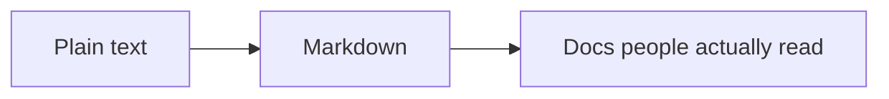

# [NikhilMath.com](https://nikhilmath.com)

My personal website, always kept up to date.

---

## I love documentation

> Code tells you *how*. Documentation tells you *why*.

Good docs are the difference between a project people use and a project people give up on. They're the first thing a newcomer reads and the last thing anyone remembers to update, and that's exactly why I care about them.

## Especially Markdown

Markdown[^1] is plain text that turns into something clean. It reads fine raw, renders almost everywhere, and lives right next to the code it describes.

| You write | You get |
| --- | --- |
| `**bold**` | **bold** |
| `*italic*` | *italic* |
| `` `code` `` | `code` |
| `[link](https://nikhilmath.com)` | [link](https://nikhilmath.com) |
| `> quote` | a blockquote |

> [!TIP]
> A README is someone's first impression of your project. Make it a good one.

## What makes docs good

- [x] Explains **why**, not just how
- [x] Shows an example before the details
- [x] Stays up to date with the code
- [ ] Gets read by everyone *(still working on this one)*

Psst, look under the hood

 

Everything on this page (the table, the diagram, the checklist, the tip, even this dropdown) is written in Markdown. [See the raw source](https://github.com/NikhilMath/NikhilMath/blob/main/README.md?plain=1).

[^1]: Created in 2004 by John Gruber, with help from Aaron Swartz.
